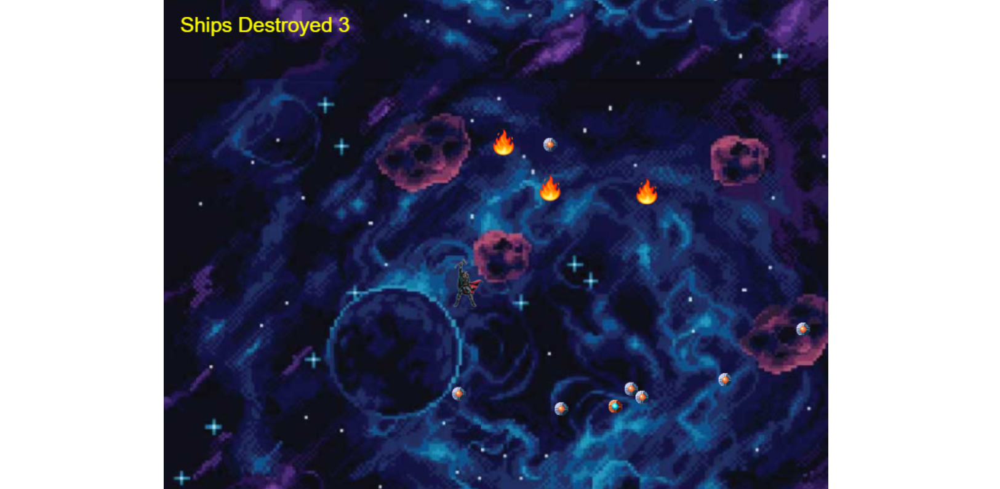

# Galaxy RPG-Game

> Built using JavaScript and Phaser 3, this Game features Thor in a mission to save the Galaxy. He has to collide with the enemy power balls in order to destroy them. He is supposed to avoid colliding into the burning meteoroids since they are more powerful than his hammer.

## Live Demo Link:

[https://bigwizzo.github.io/Galaxy-RPG-Game/](https://bigwizzo.github.io/Galaxy-RPG-Game/)

## :hammer: Built with

- HTML5
- JavaScript
- Webpack
- Linters
- VS Code
- Phaser 3

## Game Functionality

### Concept

- Control Thor to fly around in the galaxy.
- Destroy enemy power balls by colliding into them.
- Avoid colliding into burning meteoroids.

### Controls

You need a keyboard to control the Player Thor.

- Press ⬆️ to move up.
- Press :arrow_down: to move down.
- Press ➡️ to go right.
- Press ⬅️ to go left.

When you collide with a power ball.

- Earn 10 points by colliding into a power ball.
- Win the game by destroying all the power balls.

When you collide with a meteoroid.

- meteoroids are fatal, avoid them.
- It's Game Over if thor is hit by a meteoroid.

## :construction_worker: Getting Started

To get a local copy up and running follow these simple steps:

1. Go to the [repository page](https://github.com/BigWizzo/Galaxy-RPG-Game).
2. Press the "Code" button and copy the link.
3. Clone it using git command `git clone https://github.com/BigWizzo/Galaxy-RPG-Game`.
4. Move to the folder: `cd Galaxy-RPG-Game`.
5. run `npm install`.
6. on your command line run: `npm run dev` (development) or `npm run build` (Production).
7. start server:
   4.1 [live server](https://marketplace.visualstudio.com/items?itemName=ritwickdey.LiveServer) can be used to visualize the webapp in live version or
   4.2 execute on the command line `server dist index.html 8080 --reload` and enter to your browser to `localhost:8080`.

## :construction_worker: How to run tests

1. Move to the folder: `cd Galaxy-RPG-Game`.
2. Run `npm run test`.

## :bust_in_silhouette: Author

👤 **Will Nyamunokora**

- Github: [@bigwizzo](https://github.com/bigwizzo)
- Twitter: [@willnyamunokora](https://twitter.com/willnyamunokora)
- Linkedin: [@willnyamunokora](https://linkedin.com/in/willnyamunokora)

## 🤝 :raised_hand: :raised_hand: Contributions

Contributions, issues, and feature requests are welcome!

Feel free to check the [issues page](https://github.com/BigWizzo/Galaxy-RPG-Game/issues).

## :muscle: Show your support

Give a ⭐️ if you like this project!

## :grey_exclamation: Acknowledgment

- [Microverse](https://www.microverse.org/)
- [Zenva Pty Ltd](https://gamedevacademy.org/how-to-create-a-turn-based-rpg-game-in-phaser-3-part-1/)
- Stand up team
- TSEs

## 📝 License

This project is [MIT](https://opensource.org/licenses/MIT) licensed.
